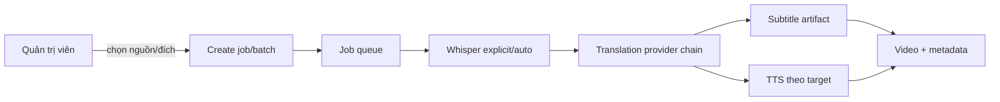

# URD — Dịch đa ngôn ngữ

- Hệ thống: VidTrans Creator Studio
- Feature: `multilingual-translation`
- Version: `1.0`
- Trạng thái: `Approved scope / implementation in progress`
- Nguồn duyệt: người dùng xác nhận “oki bắt đầu đi” sau PLAN 0.1.

## I. Thông tin chung

### 1. Mục đích

Cho phép một job video nhận diện lời nói từ nhiều ngôn ngữ, dịch sang ngôn ngữ đích được chọn, tạo phụ đề và tùy chọn lồng tiếng đúng locale mà vẫn retry được job cũ Trung → Việt.

### 2. Phạm vi

- Nguồn: `auto`, `vi`, `en`, `zh-CN`, `ja`, `ko`, `th`, `id`, `es`.
- Đích: mọi mã cụ thể trong danh sách trên.
- Speech/Whisper hỗ trợ toàn bộ danh sách; OCR giai đoạn này chỉ bảo đảm cho `zh-CN`.
- Google và MyMemory nhận cặp ngôn ngữ động.
- TTS Edge/gTTS chọn locale theo ngôn ngữ đích.
- Job cũ thiếu cấu hình dùng `zh-CN → vi`.

Ngoài phạm vi: OCR đa ngôn ngữ, model dịch offline, dialect tùy chỉnh.

### 3. Thuật ngữ

| Thuật ngữ | Ý nghĩa |
|---|---|
| Source language | Ngôn ngữ lời thoại trước dịch; có thể `auto` |
| Detected language | Ngôn ngữ Whisper phát hiện thực tế |
| Target language | Ngôn ngữ phụ đề/TTS đầu ra |
| Language profile | Ánh xạ mã nội bộ sang Whisper/provider/TTS/voice |

### 4. Nguồn

| ID | Nguồn | Trạng thái | Liên quan |
|---|---|---|---|
| SRC_01 | `ANALYSIS.md` 0.1 | Đã đọc | toàn bộ |
| SRC_02 | `PLAN.md` 0.1 | Đã duyệt | toàn bộ |
| SRC_03 | source hiện tại | Đã kiểm kê | compatibility |

## II. Tổng quan

Actor chính là quản trị viên VidTrans. Worker xử lý bất đồng bộ.

## III. Yêu cầu chi tiết

### UC_01 — Tạo job đa ngôn ngữ

| Thuộc tính | Nội dung |
|---|---|
| Actor | Quản trị viên |
| Trigger | Gửi form file đơn hoặc batch |
| Pre-condition | Đã xác thực; có nguồn video hợp lệ |
| Post-condition | Job lưu source/target và vào queue, hoặc trả 400 không tạo job |

| Bước | Hành động | Kết quả | BR |
|---|---|---|---|
| MF01 | Chọn nguồn và đích | UI gửi mã chuẩn | BR01, BR02 |
| MF02 | API validate | Tạo job và resume config | BR03 |
| MF03 | Worker chạy | Cấu hình được giữ tới artifact | BR04 |

| BR | Quy tắc |
|---|---|
| BR01 | Source thuộc catalog và có thể là `auto` |
| BR02 | Target thuộc catalog, không được `auto` |
| BR03 | Nếu source cụ thể trùng target thì trả 400 |
| BR04 | Job mới luôn lưu `source_language` và `target_language` trong config/job metadata |
| BR05 | Mode 2/3 chỉ hợp lệ khi target có voice profile |
| BR06 | `burned` OCR chỉ hợp lệ với source `zh-CN`; `auto` subtitle source với source khác Trung dùng speech |

| AC | Given | When | Then |
|---|---|---|---|
| AC01 | source `ja`, target `vi` | tạo batch | job lưu đúng cặp ngôn ngữ |
| AC02 | source `en`, target `en` | tạo batch | HTTP 400, không tạo job |
| AC03 | target `auto` | tạo batch | HTTP 400 |

### UC_02 — Nhận diện và dịch

| BR | Quy tắc |
|---|---|
| BR07 | Source cụ thể được ánh xạ sang mã Whisper; `auto` không ép language |
| BR08 | ASR trả detected language khi engine cung cấp |
| BR09 | Provider nhận mã source đã chốt và target từ catalog |
| BR10 | Google 429 chuyển MyMemory; cả hai bị giới hạn thì backoff và dừng có chẩn đoán |
| BR11 | Validation không loại đầu ra chỉ vì có chữ Hán; dùng empty/unchanged/provider error và script rule theo target |
| BR12 | Artifact ghi source requested, source detected và target thực tế |

| AC | Given | When | Then |
|---|---|---|---|
| AC04 | source auto, speech Nhật | ASR chạy | detected `ja` được dùng cho dịch |
| AC05 | target `zh-CN` | provider trả chữ Hán khác nguồn | bản dịch được chấp nhận |
| AC06 | Google 429 | MyMemory thành công | job tiếp tục thay vì fail toàn bộ cue |

### UC_03 — Phụ đề và lồng tiếng

| BR | Quy tắc |
|---|---|
| BR13 | Subtitle artifact giữ target language và font hỗ trợ script |
| BR14 | Edge voice nam/nữ lấy từ LanguageProfile của target |
| BR15 | gTTS fallback dùng locale target, không cố định `vi` |
| BR16 | Mode chỉ phụ đề không yêu cầu TTS voice |

### UC_04 — Retry job cũ

| BR | Quy tắc |
|---|---|
| BR17 | Resume config thiếu source/target được đọc là `zh-CN/vi` |
| BR18 | Retry job mới giữ nguyên cặp ngôn ngữ, không lấy mặc định UI hiện tại |

## Dữ liệu

| Field | Kiểu | Quy tắc |
|---|---|---|
| `source_language` | string | required cho job mới; default legacy `zh-CN` |
| `target_language` | string | required cho job mới; default legacy `vi` |
| `detected_language` | string/null | worker ghi khi ASR auto detect |

## NFR

| ID | Yêu cầu | Kiểm chứng |
|---|---|---|
| NFR01 | Không đọc/log secret provider/proxy | code review |
| NFR02 | Không gọi provider thật trong unit test | mock opener |
| NFR03 | Job cũ retry được | regression test |
| NFR04 | Provider rate limit không tạo request storm | cooldown/backoff test |
| NFR05 | Validation catalog thống nhất giữa API/pipeline | unit/API test |

## IV. Phụ lục API

`POST /process-video`, `POST /convert`, `POST /api/v1/batches` thêm form fields:

- `source_language`, default `zh-CN` để tương thích.
- `target_language`, default `vi` để tương thích.

Không thay đổi auth, trạng thái HTTP hay cơ chế queue hiện hữu ngoài validation 400 cho cặp ngôn ngữ sai.

